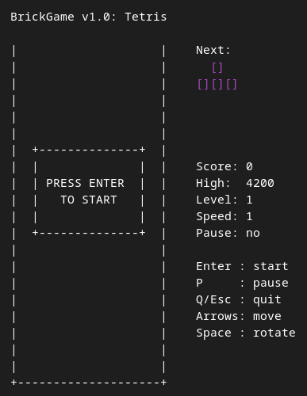
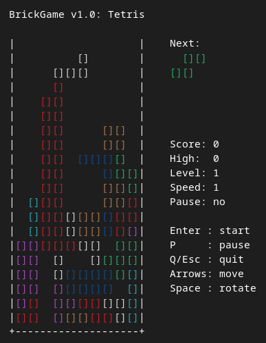

# BrickGame v1.0

Tetris implementation in C11 with a terminal interface based on `ncurses`.

 

This repository currently covers the following:

- Tetris game logic as a separate library
- terminal UI in `ncurses`
- finite-state machine based game flow
- movement, rotation, row clearing, next-piece preview, pause, and game over
- unit tests with `check`

## Project Structure

```text
src/brick_game/tetris  - game library
src/gui/cli            - terminal interface
tests/                 - unit tests
docs/fsm.md            - FSM description
```

## Build

Build the CLI application:

```bash
make all
```

The binary will be created at:

```bash
./build/brick_game_cli
```

## Run

Run from the build directory output:

```bash
./build/brick_game_cli
```

Or install locally and run:

```bash
make install
~/.local/bin/brick_game_cli
```

If `~/.local/bin` is already in your `PATH`, you can run:

```bash
brick_game_cli
```

## Controls

- `Enter` - start game / restart after game over
- `P` - pause / resume
- `Q` or `Esc` - quit
- `Left Arrow` - move left
- `Right Arrow` - move right
- `Down Arrow` - soft/manual drop
- `Space` - rotate piece

## Implemented Gameplay

- playfield size `10x20`
- all 7 tetrominoes
- next-piece preview
- piece rotation and horizontal movement
- manual faster downward movement with `Down`
- line clearing
- game over when the top is reached
- start, pause, and game over overlays
- colored tetromino rendering in supported terminals

## Tests

Run the unit tests:

```bash
make test
```

Current tests cover the library logic, including:

- FSM transitions
- spawn collision handling
- movement and rotation
- pause behavior
- attach and line clear behavior
- board helper logic

## Coverage

Generate a coverage report:

```bash
make gcov_report
```

If `lcov` and `genhtml` are installed, the target generates an HTML report.
If they are not installed, it falls back to `gcov` text output in `report/coverage.txt`.

## Make Targets

- `make all` - build the CLI application
- `make install` - install to `~/.local/bin` by default
- `make uninstall` - remove the installed binary
- `make clean` - remove build and report artifacts
- `make dvi` - print documentation entry points
- `make dist` - create a source archive
- `make test` - run unit tests
- `make gcov_report` - generate coverage output

To install somewhere else, override `PREFIX`:

```bash
make install PREFIX=/usr/local
```

## Notes

- Run the game in a normal terminal window. Some IDE-integrated terminals can render `ncurses` output incorrectly.
- The public library API follows the provided assignment specification:
  - `void userInput(UserAction_t action, bool hold);`
  - `GameInfo_t updateCurrentState(void);`
- Score, persistent high score, and level progression are not implemented yet, but will be soon.
